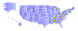

# Create Maps with PostGIS and `pg-svg`

[PostGIS](https://postgis.net/) excels at storing, manipulating and analyzing geospatial data.  But at some point it's usually desired to convert raw spatial data into a two-dimensional representation to utilize the integrative capabilities of the human visual cortex.  In other words, to see things on a map.  

PostGIS is a popular backend for mapping technology, so there are many options to choose from to create maps.  Data can be rendered to a raster image using a web map server like [GeoServer](https://geoserver.org/) or [MapServer](https://mapserver.org/); it can be converted to GeoJSON or vector tiles and shipped to a Web browser for rendering by a library such as [OpenLayers](https://openlayers.org/), [MapLibre](https://maplibre.org/) or [Leaflet](https://leafletjs.com/); or a GIS application such as [QGIS](https://qgis.org) can connect to the database and create richly-styled maps from spatial queries.  

What these options have in common is that they require external tools which need to be installed, configured and maintained in a separate environment. This can introduce unwanted complexity to a geospatial architecture.

This post presents a simple way to generate maps entirely within the database, with no external infrastructure required.  

## SVG for the win

A great way to display vector data is to use the [Scalable Vector Graphics](https://developer.mozilla.org/en-US/docs/Web/SVG) (SVG) format.  It provides rich functionality for displaying and styling geometric shapes.
SVG is widely supported by web browsers and other tools.  
By adding some CSS and Javascript it's possible to add advanced styling, 
custom popups, dynamic behaviour and interaction with other web page elements.

## Introducing `pg-svg`

Generating SVG "by hand" is difficult.  It requires detailed knowledge of the SVG format, and is complex and error-prone. 
PostGIS has had the function [`ST_AsSVG`](https://postgis.net/docs/manual-3.3/ST_AsSVG.html) for years.  But it only produces the SVG [**path data**](https://svgwg.org/svg2-draft/paths.html#PathData) attribute value.  Much more is required to create a fully-styled SVG document.

The PL/pgSQL library [`pg-svg`](https://github.com/dr-jts/pg_svg) solves this problem!  It makes it easy to convert PostGIS data into styled SVG documents.  The library provides a simple API as a set of PL/pgSQL functions which allow creating an SVG document in a single SQL query.

## A map of US High Points

The best way to understand how `pg-svg` works is to see an example.
We'll create an SVG map of the United States showing the highest point in each state.
The map has the following features:

* All 50 states are shown, with Alaska and Hawaii transformed to better fit the map
* States are labelled, and filled with a gradient
* High points are shown at their location by triangles whose color and size indicate the height of the high point.
* Tooltips provide more information about states and highpoints.   

The resulting map looks like this (to see tooltips open the [raw image](https://raw.githubusercontent.com/dr-jts/crunchyblog/master/pg-svg/us-highpt.svg)):



The SQL query to generate the map is [here](https://github.com/dr-jts/pg_svg/blob/master/demo/map/us-highpt-svg.sql).  It can be downloaded and run using `psql`:
```
psql -A -t -o us-highpt.svg  < us-highpt-svg.sql
```
The SVG output `us-highpt.svg` can be viewed in any web browser.

## How it Works

Let's break the query down to see how the data is prepared and then rendered to SVG.  A dataset of US states in geodetic coordinate system (WGS84, SRID = 4326) is required.  We used the Natural Earth states and provinces data available [here](https://www.naturalearthdata.com/downloads/10m-cultural-vectors/10m-admin-1-states-provinces/).  It is loaded into a table `ne.admin_1_state_prov` with the following command:
```
shp2pgsql -c -D -s 4326 -i -I ne_10m_admin_1_states_provinces.shp ne.admin_1_state_prov | psql
```

The query uses the SQL `WITH` construct to organize processing into simple, modular steps.  We'll describe each one in turn.

### Select US state features

First, the US state features are selected from the Natural Earth boundaries table `ne.admin_1_state_prov`.
```
us_state AS (SELECT name, abbrev, postal, geom 
  FROM ne.admin_1_state_prov
  WHERE adm0_a3 = 'USA')
```

### Make a US state map
Next, the map is made more compact by realigning the far-flung states of Alaska and Hawaii.   
This is done using PostGIS [affine transformation functions](https://postgis.net/docs/manual-3.3/reference.html#Affine_Transformation).
The states are made more proportionate using [`ST_Scale`](https://postgis.net/docs/manual-3.3/ST_Scale.html), 
and moved closer to the lower 48 using [`ST_Translate`](https://postgis.net/docs/manual-3.3/ST_Translate.html).
The scaling is done around the location of the state high point, to make it easy to apply the same transformation to the high point feature.
```
,us_map AS (SELECT name, abbrev, postal, 
    -- transform AK and HI to make them fit map
    CASE WHEN name = 'Alaska' THEN 
      ST_Translate(ST_Scale(
        ST_Intersection( ST_GeometryN(geom,1), 'SRID=4326;POLYGON ((-141 80, -141 50, -170 50, -170 80, -141 80))'),
        'POINT(0.5 0.75)', 'POINT(-151.007222 63.069444)'::geometry), 18, -17)
    WHEN name = 'Hawaii' THEN 
      ST_Translate(ST_Scale(
        ST_Intersection(geom, 'SRID=4326;POLYGON ((-161 23, -154 23, -154 18, -161 18, -161 23))'), 
        'POINT(3 3)', 'POINT(-155.468333 19.821028)'::geometry), 32, 10)
    ELSE geom END AS geom
  FROM us_state)
```
### High Points of US states
Data for the highest point in each state is provided as an inline table of values:
```
,high_pt(name, state, hgt_m, hgt_ft, lon, lat) AS (VALUES
 ('Denali',              'AK', 6198, 20320,  -151.007222,63.069444)
,('Mount Whitney',       'CA', 4421, 14505,  -118.292,36.578583)
...
,('Britton Hill',        'FL',  105,   345,  -86.281944,30.988333)
)
```
### Prepare High Point symbols
The next query does several things:
* translates the `lon` and `lat` location for Alaska and Hawaii high points to match the transformation applied to the state geometry
* computes the `symHeight` attribute for the height of the high point triangle symbol 
* assigns a fill color value to each high point based on the height
* uses `ORDER BY` to sort the high points by latitude, so that their symbols overlap correctly when rendered 
```
,highpt_shape AS (SELECT name, state, hgt_ft, 
    -- translate high points to match shifted states
    CASE WHEN state = 'AK' THEN lon + 18
      WHEN state = 'HI' THEN lon + 32
      ELSE lon END AS lon,
    CASE WHEN state = 'AK' THEN lat - 17
      WHEN state = 'HI' THEN lat + 10
      ELSE lat END AS lat,
    (2.0 * hgt_ft) / 15000.0 + 0.5 AS symHeight,
    CASE WHEN hgt_ft > 14000 THEN '#ffffff'
         WHEN hgt_ft >  7000 THEN '#aaaaaa'
         WHEN hgt_ft >  5000 THEN '#ff8800'
         WHEN hgt_ft >  2000 THEN '#ffff44'
         WHEN hgt_ft >  1000 THEN '#aaffaa'
                             ELSE '#558800'
    END AS clr
  FROM high_pt ORDER BY lat DESC)
```  
### Generate SVG elements
The previous queries transformed the raw data into a form suitable for rendering.  
Now we get to see `pg-svg` in action!
The next query generates the SVG text for each output image element, 
as separate records in a result set called `shapes`.

The SVG elements are generated in the order in which they are drawn - states and labels first, 
with high-point symbols on top. 
Let's break it down:

### SVG for states
The first subquery produces SVG shapes from the state geometries.
The [`svgShape`](https://github.com/dr-jts/pg_svg#svgshape) function produces an SVG shape element for any PostGIS geometry.
It also provides optional parameters supporting other capabilities of SVG.
Here `title` specifies that the state name is displayed as a tooltip,
and `style` specifies the styling of the shape.
Styling in SVG can be provided using properties defined in the 
[Cascaded Style Sheets (CSS)](https://developer.mozilla.org/en-US/docs/Glossary/CSS) specification.
`pg-svg` provides the [`svgStyle`](https://github.com/dr-jts/pg_svg#svgstyle) function to make it easy to specify the 
names and values of CSS styling properties.

Note that the `fill` property value is a URL instead of a color specifier.
This refers to an SVG gradient fill which is defined later.

The state geometry is also included in the subquery result set, for reasons which will be discussed below.
```
,shapes AS (
  -- State shapes
  SELECT geom, svgShape( geom,
    title => name,
    style => svgStyle(  'stroke', '#ffffff',
                        'stroke-width', 0.1::text,
                        'fill', 'url(#state)',
                        'stroke-linejoin', 'round' ) )
    svg FROM us_map
```

### SVG for State Labels
Labels for state abbrevations are positioned at the point produced by the `ST_PointOnSurface` function.
(Alternatively, `ST_MaximumInscribedCircle` could be used.)
The SVG is generated by the [`svgText`](https://github.com/dr-jts/pg_svg#svgtext) function, using the specified styling.
```
  UNION ALL
  -- State names
  SELECT NULL, svgText( ST_PointOnSurface( geom ), abbrev,
    style => svgStyle(  'fill', '#6666ff', 'text-anchor', 'middle', 'font', '0.8px sans-serif' ) )
    svg FROM us_map
```
### SVG for High Point symbols
The high point features are displayed as triangular symbols.
We use the convenient [`svgPolygon`](https://github.com/dr-jts/pg_svg#svgpolygon) function with a simple array of ordinates 
specifying a triangle based at the high point location,
with height given by the previously computed `svgHeight` column.
The title is provided for a tooltip, and the styling uses the computed `clr` attribute as the fill.
```
  UNION ALL
  -- High point triangles
  SELECT NULL, svgPolygon( ARRAY[ lon-0.5, -lat, lon+0.5, -lat, lon, -lat-symHeight ],
    title => name || ' ' || state || ' - ' || hgt_ft || ' ft',
    style => svgStyle(  'stroke', '#000000',
                        'stroke-width', 0.1::text,
                        'fill', clr  ) )
    svg FROM highpt_shape
)
```
### Produce final SVG image
The generated shape elements need to be wrapped in an `<svg>` document element. 
This is handled by the [`svgDoc`](https://github.com/dr-jts/pg_svg#svgdoc) function.

The viewable extent of the SVG data needs to be provided by the `viewbox` parameter.
The most common case is to display all of the rendered data.
An easy way to determine this is to apply the PostGIS `ST_Exrtent` aggregate function to the input data
(this is why we included the `geom` column as well as the `svg` text column).
We can include a border by enlarging the extent using the `ST_Expand` function.
The function [`svgViewBox`](https://github.com/dr-jts/pg_svg#svgviewbox) converts the PostGIS geometry for the extent into SVG format.

We also include a definition for an SVG [linear gradient](https://developer.mozilla.org/en-US/docs/Web/SVG/Element/linearGradient)
to be used as the fill style for the state features.

```
SELECT svgDoc( array_agg( svg ),
    viewbox => svgViewbox( ST_Expand( ST_Extent(geom), 2)),
    def => svgLinearGradient('state', '#8080ff', '#c0c0ff')
  ) AS svg FROM shapes;
```

The output from `svgDoc` is a `text` value which can be used anywhere that SVG is supported.

## More to Explore

We've shown how the `pg-svg` SQL function library lets you easily generate map images from PostGIS data right in the database.
This can be used as a simple ad-hoc way of visualizing spatial data.
Or, it could be embedded in a larger system to automate repetitive map generation workflows.

Although SVG is a natural fit for vector data, there may be situations where producing a map as a bitmap (raster) image makes sense.  
For a way of generating raster maps right in the database
see this PostGIS Day 2022 [presentation](https://www.youtube.com/watch?v=5Zg8j9X2f-Y).
This would be especially appealing where the map is displaying data stored using [PostGIS raster data](https://postgis.net/docs/manual-3.3/using_raster_dataman.html).  It would also be possible to combine vector and raster data into a hybrid SVG/image output.

Although we've focussed on creating maps of geospatial data, SVG is often used for creating other kinds of graphics.
Ror examples of using it to create geometric and mathematical designs see the `pg-svg` [`demo`](https://github.com/dr-jts/pg_svg/tree/master/demo) folder.
You could even use `pg-svg` to generate charts of non-spatial data (although this would be better handled by a more task-specific API).

Let us know if you find `pg-svg` useful, or if you have ideas for improving it! 
