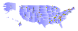

# Creating Maps with PostGIS and `pg-svg`

One of the most informative things to do with geospatial data is to visualize it on a map.  *Comment about how PostGIS data is generally just data* There are many ways of doing this.  Data can be rendering to a raster image using a map server like GeoServer or MapServer; the raw data can be shipped to a Web browser and rendered using a library such as OpenLayers or Leaflet; or a client GIS application such as QGIS can connect to the database and create richly-styled maps from the data.  

- For another option for database-generated maps, see this PostGIS Day 2022 [presentation](https://www.youtube.com/watch?v=5Zg8j9X2f-Y) showing how to define and render bitmap images. 

This post presents a way to generate maps entirely within the database, with no external application required.  This is done by using the SVG (Scalable Vector Graphics) format, which is a graphical format that is widely supported by web browsers and other tools.  Generating SVG can be complex, but a PL/pgSQL library called `pg-svg` makes it easy.  The library provides a set of high-level functions which make it easy to convert PostGIS data into styled SVG documents.

- discuss how SVG requires shapes, scaling, styling and optionally identifiers and CSS

## Introducing `pg-svg`

PostGIS has had the function [`ST_AsSVG`](https://postgis.net/docs/manual-3.3/ST_AsSVG.html) for years.  But attempting to use it will quickly reveal that it is only a partial solution for generating an SVG image.  `ST_AsSVG` produces the [**path data**](https://svgwg.org/svg2-draft/paths.html#PathData) that specifies the outline of a shape to be rendered in SVG.  However, much more is required:

* the path data must be encoded as the `d` attribute of a `<path>` element
* the element needs to be styled
* Polygons with holes require multiple path elements
* Multigeometries are represented as groups of paths
* Simple shapes such as points require different elements
* The SVG image needs to be provided as an SVG `<svg>` element
* the extent of the rendered data must be specified, along with (optionally) the size of the rendered image

Doing this manually requires detailed knowledge of the SVG format, and is complex and error-prone.  
But the `pg-svg` library can do all this in a single SQL query with a simple API.

## Example

The easiest way to understand pg-svg is to see an example.  We'll create a map of the United States showing the highest point in each state.
To show the power of SVG and `pg-svg` for generating and styling shapes the map will have the following features:

* All 50 states are shown, with Alaska and Hawaii transformed to better fit the map
* States are labelled, and filled with a gradient
* High points are shown at their location by triangles whose color and size indicate the height of the high point.
* Tooltips provide more information about states and highpoints.   

The resulting map looks like this (to see tooltips open the [raw image](https://raw.githubusercontent.com/dr-jts/crunchyblog/master/pg-svg/us-highpt.svg)):



The SQL query to generate the map is [here](https://github.com/dr-jts/pg_svg/blob/master/demo/map/us-highpt-svg.sql).  It can be downloaded and run using `psql`:
```
psql -A -t -o us-highpt.svg  < us-highpt-svg.sql
```
The SVG output can be view in a web browser.

## How it Works

Let's break the query down to see how the data is prepared and then rendered to SVG.  A dataset of US states in geodetic (WGS84, SRID = 4326) is required.  We used the Natural Earth states and provinces data from here.  It can be loaded into a table `ne.admin_1_state_prov` with the following command:
```
shp2pgsql -c -D -s 4326 -i -I ne_10m_admin_1_states_provinces.shp ne.admin_1_state_prov | psql
```

The SQL `WITH` construct allows organizing the query into simple, modular steps.  We'll describe each one in turn.

First, the US state features are selected from the loaded Natural Earth boundaries table
```
us_state AS (SELECT name, abbrev, postal, geom 
  FROM ne.admin_1_state_prov
  WHERE adm0_a3 = 'USA')
```
Next, the geometry for states Alaska and Hawaii is translated and scaled to make the map more compact.  The scaling is done around the location of the state high point, to make it easy to apply the same transformation to the high point itself.
```
,us_map AS (SELECT name, abbrev, postal, 
    -- transform AK and HI to make them fit map
    CASE WHEN name = 'Alaska' THEN 
      ST_Translate(ST_Scale(
        ST_Intersection( ST_GeometryN(geom,1), 'SRID=4326;POLYGON ((-141 80, -141 50, -170 50, -170 80, -141 80))'),
        'POINT(0.5 0.75)', 'POINT(-151.007222 63.069444)'::geometry), 18, -17)
    WHEN name = 'Hawaii' THEN 
      ST_Translate(ST_Scale(
        ST_Intersection(geom, 'SRID=4326;POLYGON ((-161 23, -154 23, -154 18, -161 18, -161 23))'), 
        'POINT(3 3)', 'POINT(-155.468333 19.821028)'::geometry), 32, 10)
    ELSE geom END AS geom
  FROM us_state)
```


