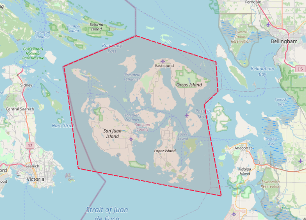
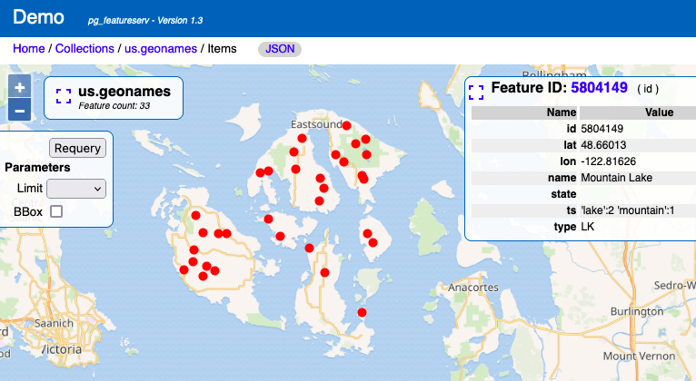
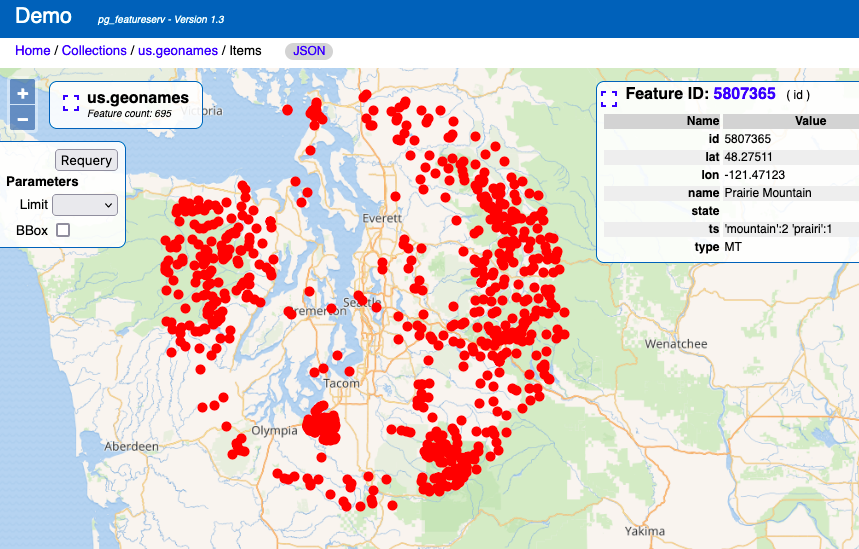

# Spatial filtering in pg_featureserv with CQL 

In a [previous post](https://blog.crunchydata.com/blog/cql-filtering-in-pg_featureserv) 
we announced support for **CQL filters** in [`pg_featureserv`](https://github.com/CrunchyData/pg_featureserv).
CQL ([Common Query Language](https://docs.ogc.org/DRAFTS/21-065.html)) 
is part of the *Open Geospatial Consortium's* (OGC)
[OGC API](https://ogcapi.ogc.org/#standards) suite of standards.

PostgreSQL and PostGIS are a perfect match for OAPIF and CQL, because they make it very easy to perform feature queries,
and can execute them very efficiently due to the power of database indexing and query evaluation.

This capability provides better access to the power of PostgreSQL.

Naturally, CQL provides the ability to filter geospatial data via spatial filters.
Of course, we implemented this to ensure that `pg_featureserv` is able to take full advantage of 
the spatial capabilities of PostGIS.

The companion project [`pg_tileserv`](https://github.com/CrunchyData/pg_tileserv) also supports CQL, 
and spatial filtering works there as well.

## CQL Spatial Filters

Spatial filtering in CQL involves using **spatial predicates** to test a condition on the geometry property of features.
Spatial predicates include the familiar OGC Simple Features predicates for spatial relationships:

* `INTERSECTS` - tests whether two geometries intersect
* `DISJOINT` - tests whether two geometries have no points in common
* `CONTAINS` - tests whether a geometry contains another
* `WITHIN` - tests whether a geometry is within another
* `EQUALS` - tests whether two geometries are topologically equal
* `CROSSES` - tests whether the geometries cross
* `OVERLAPS` - tests whether the geometries overlap
* `TOUCHES` - tests whether the geometries touch

`pg_featureserv` also implements the **distance predicate** `DWITHIN`.

Spatial predicates are typically used to compare the feature geometry property against a geometry value. 
Geometry values are expressed in [Well-Known Text](https://en.wikipedia.org/wiki/Well-known_text_representation_of_geometry) (WKT):

```
POINT (1 2)
LINESTRING (0 0, 1 1)
POLYGON ((0 0, 0 9, 9 0, 0 0))
POLYGON ((0 0, 0 9, 9 0, 0 0),(1 1, 1 8, 8 1, 1 1))
MULTIPOINT ((0 0), (0 9))
MULTILINESTRING ((0 0, 1 1),(1 1, 2 2))
MULTIPOLYGON (((1 4, 4 1, 1 1, 1 4)), ((1 9, 4 9, 1 6, 1 9)))
GEOMETRYCOLLECTION(POLYGON ((1 4, 4 1, 1 1, 1 4)), LINESTRING (3 3, 5 5), POINT (1 5))
ENVELOPE (1, 2, 3, 4)
```
By default, the coordinate reference system (CRS) of geometry values is [**geodetic**](https://en.wikipedia.org/wiki/Geodetic_datum) (longitude and latitude).  
If needed a different CRS can be specified by using the `filter-crs` parameter.
(PostGIS supports a large number of standard coordinate reference systems.)

Here are some examples of spatial filter conditions:
```
INTERSECTS(geom, ENVELOPE(-100, 49, -90, 50) )
CONTAINS(geom, POINT(-100 49) )
DWITHIN(geom, POINT(-100 49), 0.1)
```
Of course, these can be combined with attribute conditions to express real-world queries.

## Example of a spatial filter using INTERSECTS

For these examples we'll use the U.S. [Geographic Names Information System](https://en.wikipedia.org/wiki/Geographic_Names_Information_System) (GNIS) dataset.
It contains more than 2 million points for named geographical features.
We've loaded this data into a spatial table called `us.geonames` with a column called `geom` of type
[`geography`](https://blog.crunchydata.com/blog/postgis-and-the-geography-type).
(we'll explain why it is better to use `geography` rather than `geometry` below).
We can now query this with `pg_featureserv`, and view query results on the include UI.

For this example we'll query water features on the [San Juan Islands](https://en.wikipedia.org/wiki/San_Juan_Islands)
in the state of Washington, USA.
Because there is no GNIS attribute providing region information, we have to use a **spatial filter**
to specify the area we want to query.
We used [QGIS](https://www.qgis.org) to create a polygon enclosing the islands.



We can convert the polygon to WKT and use it in an `INTERSECTS` spatial predicate
(since we are querying points, `WITHIN` could be used as well - it produces the same result).
To retrieve only water features (Lakes and Reservoirs) we add the condition `type IN ('LK','RSV')`.
The query URL is:
```
http://localhost:9000/collections/public.geonames/items.html?filter=type IN ('LK','RSV') AND INTERSECTS(geom,POLYGON ((-122.722 48.7054, -122.715 48.6347, -122.7641 48.6046, -122.7027 48.3885, -123.213 48.4536, -123.2638 48.6949, -123.0061 48.7666, -122.722 48.7054)))
```
The result of the query is a dataset containing 33 GNIS points:



## Example of a spatial filter using DWITHIN

Now we'll show an example of using a distance-based spatial filter, using the `DWITHIN` predicate.
This is the reason we loaded the GNIS data as `geography`.  
`DWITHIN` tests whether a feature geometry is within a given distance of a geometry value.
By using the `geography` type, we can specify the distance in metres, which are the units of measure of the geodetic EPSG:4326 coordinate system.
If we had loaded the dataset using the `geometry` type, the units would have been degrees, which is awkward to use.
Also, `geography` computes the distance correctly on the surface of the earth (using a great-circle distance).

Let's query for mountains (`type = 'MT'`) within 100 kilometres of Seatle (lat/long of about 47.6,-122.34 - note that WKT requires this as long-lat).
The query URL is:
```
http://localhost:9000/collections/us.geonames_geo/items.html?filter=type = 'MT' AND DWITHIN(geom,Point(-122.34 47.6),100000)&limit=1000
```
This gives a result showing 695 mountains near Seattle. It's a hilly place!



filter-crs example?


## Try it yourself!

CQL filtering will be included in the forthcoming `pg_featureserv` Version 1.3.
But you can try it out now by [downloading](https://github.com/CrunchyData/pg_featureserv#download) the latest build. 
Let us know what use cases you find for CQL spatial filtering!

