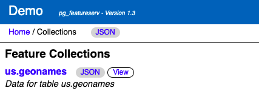
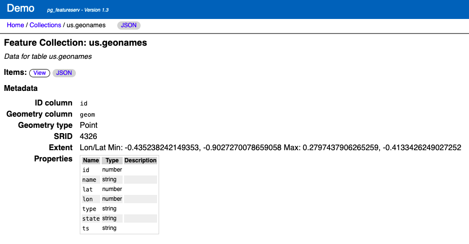

# Spatial Filters in pg_featureserv with CQL 

[`pg_featureserv`](https://github.com/CrunchyData/pg_featureserv) provides access
to the powerful spatial database capabilities of [PostGIS](https://postgis.net/) and [PostgreSQL](https://www.postgresql.org/)
via a lightweight **web service**.
To do this it implements the [OGC API for Features](https://ogcapi.ogc.org/features/) (OAPIF) RESTful protocol.
OAPIF is part of the *Open Geospatial Consortium* (OGC)
[OGC API](https://ogcapi.ogc.org/#standards) suite of standards.

In a [previous post](https://blog.crunchydata.com/blog/cql-filtering-in-pg_featureserv) 
we announced an exciting new capability for `pg_featureserv` - support for **CQL filters**.
CQL ([Common Query Language](https://docs.ogc.org/DRAFTS/21-065.html)) is another OGC standard
that provides the equivalent of SQL `WHERE` clauses for web queries. 

As you would expect given the OGC focus on promoting ease-of-access to spatial information,
CQl also supports **spatial filtering**.
This lets us take advantage of PostGIS's ability to query spatial data very efficiently.
In this post we'll show some examples of spatial filtering using CQL with `pg_featureserv`.

The companion vector tile service [`pg_tileserv`](https://github.com/CrunchyData/pg_tileserv) also supports CQL, 
and spatial filtering works there as well.

## CQL Spatial Filters

Spatial filtering in CQL involves using **spatial predicates** to test a condition on the geometry property of features.
Spatial predicates include the standard [*OGC Simple Features*](https://www.ogc.org/standards/sfs) predicates for spatial relationships:

* `INTERSECTS` - tests whether two geometries intersect
* `DISJOINT` - tests whether two geometries have no points in common
* `CONTAINS` - tests whether a geometry contains another
* `WITHIN` - tests whether a geometry is within another
* `EQUALS` - tests whether two geometries are topologically equal
* `CROSSES` - tests whether the geometries cross
* `OVERLAPS` - tests whether the geometries overlap
* `TOUCHES` - tests whether the geometries touch

`pg_featureserv` also implements the **distance predicate** `DWITHIN`.

Spatial predicates are typically used to compare the feature geometry property against a geometry value. 
Geometry values are expressed in [Well-Known Text](https://en.wikipedia.org/wiki/Well-known_text_representation_of_geometry) (WKT):

```
POINT (1 2)
LINESTRING (0 0, 1 1)
POLYGON ((0 0, 0 9, 9 0, 0 0))
POLYGON ((0 0, 0 9, 9 0, 0 0),(1 1, 1 8, 8 1, 1 1))
MULTIPOINT ((0 0), (0 9))
MULTILINESTRING ((0 0, 1 1),(1 1, 2 2))
MULTIPOLYGON (((1 4, 4 1, 1 1, 1 4)), ((1 9, 4 9, 1 6, 1 9)))
GEOMETRYCOLLECTION(POLYGON ((1 4, 4 1, 1 1, 1 4)), LINESTRING (3 3, 5 5), POINT (1 5))
ENVELOPE (1, 2, 3, 4)
```
By default, the coordinate reference system (CRS) of geometry values is [**geodetic**](https://en.wikipedia.org/wiki/Geodetic_datum) (longitude and latitude).  
If needed a different CRS can be specified by using the `filter-crs` parameter.
(PostGIS supports a large number of standard coordinate reference systems.)

Here are some examples of spatial filter conditions:
```
INTERSECTS(geom, ENVELOPE(-100, 49, -90, 50) )
CONTAINS(geom, POINT(-100 49) )
DWITHIN(geom, POINT(-100 49), 0.1)
```
Of course, these can be combined with attribute conditions to express real-world queries.

## Publishing Geographic Names

For these examples we'll use the U.S. [Geographic Names Information System](https://en.wikipedia.org/wiki/Geographic_Names_Information_System) (GNIS) dataset.
It contains more than 2 million points for named geographical features.
We load this data into a PostGIS spatial table called `us.geonames`.
The point location values are stored in a column called `geom` of type
[`geography`](https://blog.crunchydata.com/blog/postgis-and-the-geography-type).
(PostGIS allows storing spatial data as either `geometry` or `geography`.  We'll explain later why for this case it is better to use `geography`).
We create a spatial index on this column to provide fast spatial querying.

```sql
CREATE TABLE us.geonames (
    id integer PRIMARY KEY,
    name text,
    lat double precision,
    lon double precision,
    type text,
    state text,
    geom geography(Point),
    ts tsvector
);

CREATE INDEX us_geonames_gix ON us.geonames USING GIST ( geom );
```


We can now publish the dataset with `pg_featureserv`, and view query results on the web UI.

The service `collections` page shows the published tables and views 
(here we have used the configuration `Database.TableIncludes` setting to publish just the `us` schema):
```
http://localhost:9000/collections.html
```


The `collections\us.geonames` page shows the collection metadata:
```
http://localhost:9000/collections/us.geonames.html
```


## Querying with `INTERSECTS`

For this example we'll query water features on the [San Juan Islands](https://en.wikipedia.org/wiki/San_Juan_Islands)
in the state of Washington, USA.
Because there is no GNIS attribute providing region information, we have to use a **spatial filter**
to specify the area we want to query.
We used [QGIS](https://www.qgis.org) to create a polygon enclosing the islands.


We can convert the polygon to WKT and use it in an `INTERSECTS` spatial predicate
(since we are querying points, `WITHIN` could be used as well - it produces the same result).
To retrieve only water features (Lakes and Reservoirs) we add the condition `type IN ('LK','RSV')`.
The query URL is:
```
http://localhost:9000/collections/public.geonames/items.html?filter=type IN ('LK','RSV') AND INTERSECTS(geom,POLYGON ((-122.722 48.7054, -122.715 48.6347, -122.7641 48.6046, -122.7027 48.3885, -123.213 48.4536, -123.2638 48.6949, -123.0061 48.7666, -122.722 48.7054)))
```
The result of the query is a dataset containing 33 GNIS points:


## Querying with `DWITHIN`

Now we'll show an example of using a distance-based spatial filter, using the `DWITHIN` predicate.
This is the reason we loaded the GNIS data as `geography`.  
`DWITHIN` tests whether a feature geometry is within a given distance of a geometry value.
By using the `geography` type, we can specify the distance in **metres**, which are the units of measure of the geodetic EPSG:4326 coordinate system.
If we had loaded the dataset using the `geometry` type, the units would have been degrees, which is awkward to use.
Also, `geography` computes the distance correctly on the surface of the earth (using the [great-circle distance](https://en.wikipedia.org/wiki/Great-circle_distance)).

Let's query for mountains (`type = 'MT'`) within 100 kilometres of Seatle (lat/long of about 47.6,-122.34 - note that WKT requires this as long-lat).
The query URL is:
```
http://localhost:9000/collections/us.geonames_geo/items.html?filter=type = 'MT' AND DWITHIN(geom,Point(-122.34 47.6),100000)&limit=1000
```
This gives a result showing 695 mountains near Seattle. It's a hilly place!


## Try it yourself!

CQL filtering will be included in the forthcoming `pg_featureserv` Version 1.3.
But you can try it out now by [downloading](https://github.com/CrunchyData/pg_featureserv#download) the latest build. 
Let us know what use cases you find for CQL spatial filtering!

