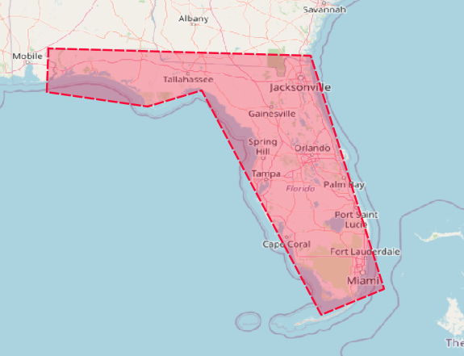

# Temporal filtering in pg_featureserv with CQL

In a [previous post](https://blog.crunchydata.com/blog/cql-filtering-in-pg_featureserv) we announced the **CQL filtering** capability in [`pg_featureserv`](https://github.com/CrunchyData/pg_featureserv).
It provides powerful functionality for attribute and [spatial](https://blog.crunchydata.com/blog/spatial-filters-in-pg_featureserv-with-cql) querying of data in PostgreSQL and PostGIS.

Another important datatype which is often present in datasets is **temporal** - i.e. data containing columns which are dates or timestamps.
PostgreSQL has extensive capabilities for specifying queries against time-valued attributes.
CQL provides acccess to a small but useful subset of these.
This post in the CQL series will show some examples of temporal filtering in `pg_featureserv` using CQL.

## CQL Temporal filters

Temporal filtering in CQL is provided using **temporal literals** and **conditions**.

**Temporal literal** values may be **dates** or **timestamps**:
```
2001-01-01
2010-04-23T01:23:45
```

> *Note: - the temporal literal syntax is based on an early version of the OGC API [Filter and CQL standard](https://portal.ogc.org/files/96288).  
> The current [draft CQL standard](https://docs.ogc.org/DRAFTS/21-065.html) has a different syntax: `DATE('1969-07-20')` and `TIMESTAMP('1969-07-20T20:17:40Z')`.  It also supports intervals:  `INTERVAL('1969-07-16', '1969-07-24')`.
> A subsequent version of `pg_featureserv` will support this syntax as well.*
 
**Temporal conditions** allow time-valued properties and literals to be compared 
via the standard boolean cmparison operators
`<`,`>`,`<=`,`>=`,`=`,`<>` and the `BETWEEN..AND` operator:
```
start_date >= 2001-01-01
event_time BETWEEN 2010-04-22T06:00 AND 2010-04-23T12:00
```

> *The [draft CQL standard](https://docs.ogc.org/DRAFTS/21-065.html#_temporal_operators) provides dedicated temporal operators, such as `T_AFTER`, `T_BEFORE`, `T_DURING`, etc.  
> A future version of `pg_featureserv` will likely provide these operators.*

## Publishing Historical Tropical Storm tracks

We'll demonstrate temporal filters using a dataset with a strong time linkage: tracks of tropical storms (or hurricanes).
There is a dataset of **Historical Tropical Storm Tracks** available [here](https://hifld-geoplatform.opendata.arcgis.com/datasets/geoplatform::historical-tropical-storm-tracks).

The data requires some preparation.  It is stored as a set of records of line segments representing 6-hour long sections
of storm tracks.  We want to model the data with a single record for each storm, with a line geometry showing the
entire track and the start and end time for the track. 

The data is provided in Shapefile format.  
As expected for a worldwide dataset, it is in the WGS84 geodetic coordinate system (lat/long).
In PostGIS this common  
[Spatial Reference System](https://postgis.net/docs/manual-dev/using_postgis_dbmanagement.html#spatial_ref_sys) 
is assigned an identifier (SRID) of 4326.

The PostGIS [`shp2pgsql`](https://postgis.net/docs/manual-3.3/using_postgis_dbmanagement.html#shp2pgsql_usage) utility can be used to load the dataset into a spatial table called `trop_storm_raw`.
The `trop_storm_raw` table is just a temporary staging table allowing the raw data to be loaded
and made available for the transformation phase of data preparation.

```
shp2pgsql -c -D -s 4326 -i -I -W LATIN1 "Historical Tropical Storm Tracks.shp" public.trop_storm_raw | psql -d database
```
The options used are:
* `-c` - create a new table
* `-D` - use PostgreSQL dump format to load the data
* `-s` - specify the SRID of 4326
* `-i` - use 32-bit integers
* `-I` - create a GIST index on the geometry column (this is not strictly necessary, since this is just a temporary staging table)
* `-W` - specifies the encoding of the input attribute data in the DBF file

Next, create the table that has the desired data model:
```
CREATE TABLE public.trop_storm (
    btid int PRIMARY KEY,
    name text,
    wind_kts numeric,
    pressure float8,
    basin text,
    time_start timestamp,
    time_end timestamp,
    geom geometry(MultiLineString, 4326)
);
```

Now the power of SQL can be used to transform the raw data into the simpler data model.
The track sections can be combined into single tracks with a start and end time using the following query.

* The original data represents the track sections as `MultiLineString`s with single elements.
The element is extracted using 
[`ST_GeometryN`](https://postgis.net/docs/manual-dev/ST_GeometryN.html) so that the result of aggregating them using 
[`ST_Collect`](https://postgis.net/docs/manual-dev/ST_Collect.html) 
is a `MultiLineString`, not a `GeometryCollection`. (An alternative is to aggregate into a GeometryCollection
and use 
[`ST_CollectionHomogenize`](https://postgis.net/docs/manual-dev/ST_CollectionHomogenize.html) to reduce it to a `MultiLineString`.)
* The final [`ST_Multi`](https://postgis.net/docs/manual-dev/ST_Multi.html) ensures that all tracks are stored as `MultiLineStrings`, 
  as required by the type constraint on the `geom` column. 
* the filter condition `time_end - time_start < '1 year'::interval` removes tracks spanning the International Date Line.

```
WITH data AS (
 SELECT btid, name, wind_kts, pressure, basin, geom,
    make_date(year::int, month::int, day::int) + ad_time::time AS obs_time
 FROM trop_storm_raw ORDER BY obs_time
),
tracks AS (
  SELECT btid,
    MAX(name) AS name,
    MAX(wind_kts) AS wind_kts,
    MAX(pressure) AS pressure,
    MAX(basin) AS basin,
    MIN(obs_time) AS time_start,
    MAX(obs_time) AS time_end,
    ST_Multi( ST_LineMerge( ST_Collect( ST_GeometryN(geom, 1)))) AS geom
  FROM data GROUP BY btid
)
INSERT INTO trop_storm
SELECT * FROM tracks WHERE time_end - time_start < '1 year'::interval;
```
This is a small dataset, and `pg_featureserv` does not require one, 
but as per best practice we can create a spatial index on the geometry column:
```
CREATE INDEX trop_storm_gix ON public.trop_storm USING GIST ( geom );
```

Once the `trop_storm` table is created and populated, it can be published using `pg_featureserv`:

```
http://localhost:9000/collections.html
```


The dataset can be viewed using `pg_featureserv`'s built-in map viewer
(note that it is probably necessary to increase the limit on the number of response features 
to see all 567 records displayed):

```
http://localhost:9000/collections/public.trop_storm/items.html?limit=1000
```


## Querying by Time Range

That's a lot of storm tracks.  It would be easier to visualize a smaller number of tracks.
A natural way to subset the data is by querying over a time range.
Let's retrieve the storms between the start of 2005 and the end of 2009. 
This is done by adding a `filter` parameter with a CQL expression against the dataset temporal property `time_start` 
(storms typically do not span the start of years).
To query values lying between a range of times it is convenient to use the `BETWEEN` operator. 
The filter condition is `time_start BETWEEN 2005-01-01 AND 2009-12-31`.
The full request is:
```
http://localhost:9000/collections/public.trop_storm/items.html?filter=time_start BETWEEN 2005-01-01 AND 2009-12-31&limit=100
```

Submitting this query produces a result with 68 tracks:


## Querying by Time and Space

Temporal conditions can be combined with other kinds of filters. For instance, we can execute a spatio-temporal query
by using a temporal condition along with a spatial condition.
In this example, we query the storms which occurred in 2005 and after in Florida.
The temporal condition is expressed as `time_start > 2005-01-01`.

The spatial condition uses the `INTERSECTS` predicate to test whether the line geometry of a storm track intersects a polygon representing the (simplified) coastline of Florida.  The polygon is provided as a geometry literal using WKT.
(For more information about spatial filtering with CQL in `pg_featureserv` see this [blog post](https://www.crunchydata.com/blog/spatial-filters-in-pg_featureserv-with-cql).)

```
POLYGON ((-81.4067 30.8422, -79.6862 25.3781, -81.1609 24.7731, -83.9591 30.0292, -85.2258 29.6511, -87.5892 29.9914, -87.5514 31.0123, -81.4067 30.8422))
```



Putting these conditions together in a boolean expression using `AND`, the request to retrieve the desired tracks from `pg_featureserv` is:

```
http://localhost:9000/collections/public.trop_storm/items.html?filter=time_start > 2005-01-01 AND INTERSECTS(geom, POLYGON ((-81.4067 30.8422, -79.6862 25.3781, -81.1609 24.7731, -83.9591 30.0292, -85.2258 29.6511, -87.5892 29.9914, -87.5514 31.0123, -81.4067 30.8422)) )&limit=100
```
This query produces a result with only 9 tracks, all of which cross Florida:


