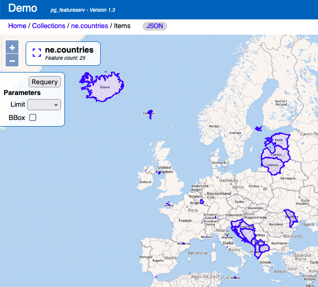

# Filtering results with CQL in `pg_featureserv`

The goal of [`pg_featureserv`](https://github.com/CrunchyData/pg_featureserv)
is to provide easy and efficient access to [PostGIS](https://postgis.net/) data from web clients.  
To do this it uses the emerging [*OGC API for Features*](https://ogcapi.ogc.org/features/)
(OAPIF) RESTful protocol, which is a natural fit for systems which need to query and communicate spatial data.
The [core OAPIF](http://docs.opengeospatial.org/is/17-069r3/17-069r3.html) specification
provides a basic framework for querying spatial datasets, but it has only limited capability 
to express filtering subsets of spatial tables.  In particular, it only allows filtering on single attribute values,
and it only supports spatial filtering via the `bbox` query parameter (in PostGIS terms, this is equivalent to using the `&&` operator with a `box2d`).

Of course, PostGIS and PostgresQL provide much more powerful filtering capabilities. 
It would be very nice to be able to use these via `pg_featureserv`.
Luckily, the OGC has defined the Common Query Language (CQL) which (as the name suggests) is a close match to SQL filtering capabilities.
This is being issued under the OGC API umbrella as CQL2 (currently in draft).

Recently we added `pg_featureserv` support for most of CQL2.
Here we'll describe the powerful new capability it provides.

## CQL Overview

CQL is a simple language to describe **logical expressions**. 
A CQL expression applies to values provided by feature properties and constants including numbers, booleans and text values.
Values can be combined using the arithmetic operators `+`,`-`,`*`, `/` and `%` (modulo).
Conditions on values are expressed using simple comparisons (`<`,`>`,`<=`,`>=`,`=`,`<>`) and more complex predicates:
```
prop IN (val1, val2, ...)
prop BETWEEN val1 AND val2
prop IS [NOT] NULL
prop LIKE | ILIKE pattern
```
Conditions can be combined with the boolean operators `AND`,`OR` and `NOT`.

You will notice that it is very similar to SQL (probably not a coincidence!). That makes it straightforward to implement,
and more importantly **easy to use** for us database people.

CQL also defines syntax for spatial and temporal filters. We'll discuss those in a future blog post.

## Filtering with CQL

A CQL expression can be used in a `pg_featureserv` request in the `filter` parameter.  
This is converted to SQL and included in the `WHERE` clause of the underlying database query.
(Of course, this allows the database to use its query planner and any defined indexes to execute the query efficiently.)

Here's an example.  We'll query the Natural Earth admin boundaries dataset, which we've loaded into PostGIS as a spatial table.
(See [this post](https://blog.crunchydata.com/blog/crunchy-spatial-querying-spatial-features-with-pg_featureserv) 
for details on how to do this.)
We're going to retrieve information about European countries where the population is 5,000,000 or less.
The CQL expression for this is `continent = 'Europe' AND pop_est <= 5000000`.

Here's the query to get this result set (note that for safety we have URL-encoded spaces and special characters):
```
http://localhost:9000/collections/ne.countries/items.json?properties=name,pop_est&filter=continent%20=%20%27Europe%27%20AND%20pop_est%20%3C=%205000000&limit=100
```
This returns a GeoJSON response with 25 features:


By using the extension `html` instead of `json` in the request we can visualize the result in the `pg_featureserv` UI:



## More power = fewer functions

One of the cool things about `pg_featureserv` (and its companion `pg_tileserv`) is the ability to serve data provided by PostgreSQL functions.
In a previous post we showed [how to use a function to find countries where the name matches a search string](https://blog.crunchydata.com/blog/using-postgis-functions-in-pg_featureserv) .  Now we can do this more easily and flexibly by using a CQL filter (note that the `ILIKE` wildcard must be URL-encoded as `%25`):
```
http://localhost:9000/collections/ne.countries/items.html?properties=name,pop_est&filter=name%20ILIKE%20%27Mo%25%27
```


And of course the filter can be made as complex as needed if more conditions are required, which is harder to do with a function.
But function serving is still very powerful for things like [generating spatial data](https://blog.crunchydata.com/blog/tile-serving-with-dynamic-geometry) and [routing](https://blog.crunchydata.com/blog/routing-with-postgresql-and-crunchy-spatial)).

## More to come...

As promised above, we'll publish a blog post on the spatial filtering capabilities of CQL soon.
And there's other interesting spatial capabilites in `pg_featureserv` which we'll discuss in a further post.

CQL support will be rolled out in [`pg_tileserv`](https://github.com/CrunchyData/pg_tileserv) soon as well. 
This brings some exciting possibilites for large-scale data visualization!

PostgreSQL provides even more powerful expression capabilities than are available in CQL.
There's things like string concatenation and functions, the `CASE` construct for "computed if", and others.
What kinds of things would you like to see `pg_featureserv` support?

## Try it!

CQL filtering will be included in the forthcoming pg_featureserv Version 1.3.  
But you can try it out now by simply [downloading](https://github.com/CrunchyData/pg_featureserv#download) the latest build.
Let us know what use cases you find for CQL filtering!
