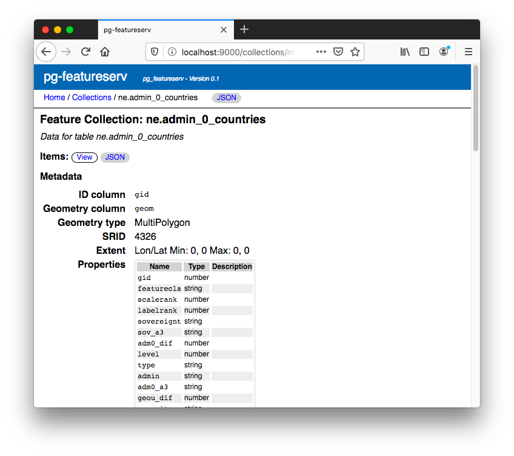
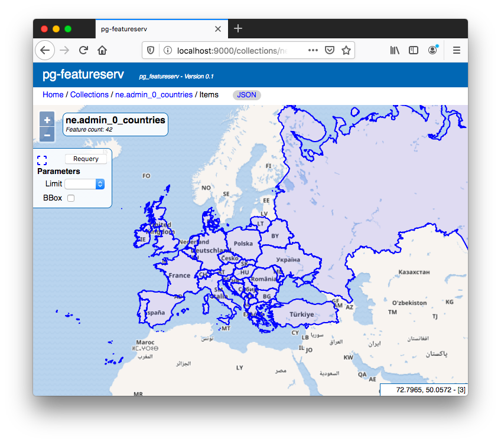

# Crunchy Spatial: Querying Spatial Features 

In addition to viewing spatial data as vector tiles using [`pg_tileserv`](https://info.crunchydata.com/blog/crunchy-spatial-tile-serving), 
it is often useful to be able to access [PostGIS](https://postgis.net/) spatial data directly.
This supports use cases such as:

* display features at a point or in an area of interest
* query features using spatial and/or attribute filters
* retrieve features for use in a web application (for tabular or map display)
* download spatial data for use in applications

For the past twenty years this need has been met by the venerable **OCG Web Feature Service (WFS)** specification.
Recently this standard has been updated to reflect modern best practices
for [web data access](https://www.w3.org/TR/dwbp/) and [spatial data on the web](https://www.w3.org/TR/sdw-bp/).
The new **[OGC API for Features](http://docs.opengeospatial.org/is/17-069r3/17-069r3.html)** standard 
now provides a [RESTful API](https://en.wikipedia.org/wiki/Representational_state_transfer) , [JSON](https://www.w3.org/TR/sdw-bp/#bib-RFC7159) and [GeoJSON](https://tools.ietf.org/rfc/rfc7946.txt) as the primary data formats,
hypermedia-friendly [linked data](https://www.w3.org/TR/sdw-bp/#linked-data),
and [OpenAPI](https://github.com/OAI/OpenAPI-Specification/blob/master/versions/3.0.2.md) support.

We realized that this new specification is a perfect fit for the 
microservice architecture of [Crunchy Spatial](https://www.crunchydata.com/products/crunchy-spatial/).  
It has the benefit
of being easily extensible, which allows us to expose more of the rich spatial capabilities of PostGIS.
This is the genesis of the [`pg_featureserv` service](https://github.com/CrunchyData/pg_featureserv) for publishing PostGIS data on the web.


*pg_featureserv minimal deployment*

`pg_featureserv` has the following features:

* Written in [Go](https://golang.org/) to allow simple deployment of binaries, with no complex dependency chains.  Also, Go provides a very effective platform for building services with low development effort and risk of defects.
* Ready-to-run configuration defaults, so that basic deployment just requires setting a database configuration string and running the program.
* Automatic publishing of database spatial tables, views and functions, using the database catalog to provide metadata.
* A web user interface to explore published feature collections and view feature data on maps.
* Support for most of the OGC Features API, including `limit` and `offset` paging, `bbox` filtering, and `properties` response shaping.
* Additional parameters to expose the power of PostGIS, including `orderBy` and `transform`.
* Function-based data sources allow generating feature datasets using complex query logic.

Best of all, `pg_featureserv` is easy to use!  Here's how to try it out. 
*(Most of the steps just involve getting some spatial data in a PostGIS database. If you already have a database, just skip to step 3 and input your own database connection information).*

1. Make a database, and enable PostGIS.
   
    ```sh
    createdb postgisftw
    psql -d postgisftw -c 'create extension postgis'
    ```

2. Download some spatial data, and load it into PostGIS.

    ```sh
    curl -o https://www.naturalearthdata.com/http//www.naturalearthdata.com/download/50m/cultural/ne_50m_admin_0_countries.zip
    unzip ne_50m_admin_0_countries.zip
    shp2pgsql -S 4326 -D -I ne_50m_admin_0_countries | psql -d postgisftw
    ```

3. Download and unzip the `pg_featureserv` binary for your platform. ([Linux](https://postgisftw.s3.amazonaws.com/pg_featureserv_latest_linux.zip), [Windows](https://postgisftw.s3.amazonaws.com/pg_featureserv_latest_windows.zip), [MacOS](https://postgisftw.s3.amazonaws.com/pg_featureserv_latest_osx.zip) )

4. Set the `DATABASE_URL` environment variable to point to your database, and start the service.

    ```sh
    export DATABASE_URL=postgresql://postgres@localhost:5432/postgisftw
    ./pg_featureserv
    ```

5. Point your browser to the service web interface.

    * http://localhost:9000

6. Explore the data!

The service provides a JSON-based API for programatic service discovery and data access
following the OGC API - Features standard.
The JSON API landing page is:

* http://localhost:9000/index.json

The feature collections can be listed using:

* http://localhost:9000/collections.json
    
The metadata for the Natural Earth countries table is at:

* http://localhost:9000/collections/ne_50m_admin_0_countries.json
    
A basic query for country features is:

* http://localhost:9000/collections/ne_50m_admin_0_countries/items.json
   
A more realistic query example is to retrieve the names of the 20 most populous countries:

* http://localhost:9000/collections/ne.admin_0_countries/items.json?orderby=pop_est:D&properties=name,pop_est&limit=20

The API for functions is similar, but uses the path `functions`.  
The `items` query for functions accepts query parameters which specify the function arguments:

* http://localhost:9000/functions/geonames_query_geom/items.json?search_word=canyon

A human-viewable web user interface is also provided, allowing easy browsing of feature collections and data. 
The top-level page is at:

   * http://localhost:9000/index.html
   
*image: top-level page?*
   
The user interface allows listing the feature collections and functions published by the service.
The metadata for each collection and function can be displayed.



A web map interface allows you to view the results of queries for features. 
It provides some simple controls to allow setting query parameters and function arguments.



The `pg_featureserv` service provides an easy-to-use, easy-to-deploy web API for publishing spatial data from PostGIS.
It's highly functional as it stands, and in the future we hope to enhance it to provide even more access to the
rich spatial functionality of PostGIS.  Try it out and let us know what you think!


