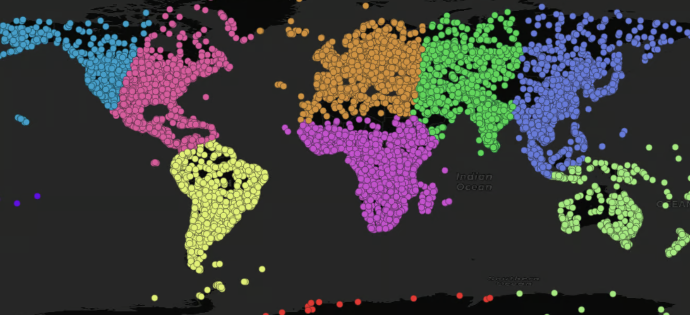
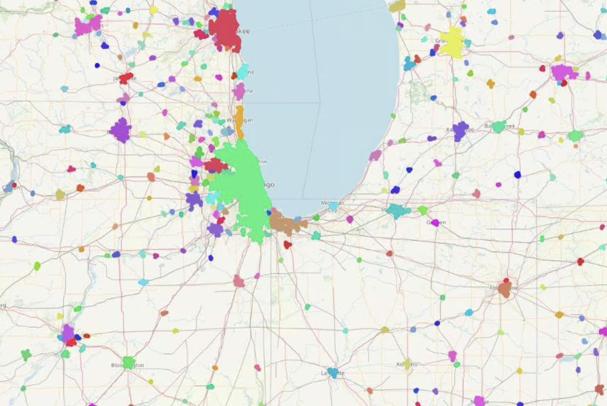

# Window Functions for Spatial SQL in PostGIS

Recently Elizabeth posted about using SQL window functions for data analysis.  
Window functions are also used in PostGIS to provide powerful capabilities for spatial data analysis and processing.

As Elizabeth noted, it's sometimes hard to figure out exactly how and when window functions should be used.
One way in which they operate is provide a way to compute a new value for *each* record in a SQL result set
determined using the values of *all* of the records in the set.  
It turns out that this pattern occurs in many different kinds of spatial analysis.  
This is because of the intrinsic nature of spatial data: features are often related to 
or influenced by the features that surround them.
This is the basis of [Tobler's First Law of Geography]()https://en.wikipedia.org/wiki/Tobler%27s_first_law_of_geography): 
"everything is related to everything else, but near things are more related than distant things."

Since window functions were introduced in PostgresSQL (in 2009 in version 8.4)
PostGIS is taking advantage of PostgreSQL support for window functions to provide spatial analytic capabilities
with an easy-to-use interface.

Clustering

Clustering based on spatial proximity or relationship is an obvious application of Tobler's First Law.
Window functions are an ideal interface for clustering algorithms, since
clustering requires scanning an entire set of spatial features and returning a
cluster id for each feature in the set.

Recently Paul Ramsey wrote some blog posts about PostGIS window functions for clustering:

* ST_ClusterDBSCAN ...

* ST_ClusterKMeans ...

## Polygonal Coverage Processing

PostGIS recently added functions to help support processing simple polygonal coverages.  

ST_CoverageInvalidEdges

ST_CoverageSimplify

## More functions to come

ST_LineMergeWin

ST_SimplifyPreserveTopologyWin

